<div align="center">

<picture>
    <source media="(prefers-color-scheme: dark)" srcset="./assets/dark.svg">
    <source media="(prefers-color-scheme: light)" srcset="./assets/light.svg">
    
</picture>

<br>

# Hi, I'm Alsya Kanaya Dzikra 👋

### Full Stack Developer • Information Technology Student • AI Enthusiast

> *"Building useful digital products through code, innovation, and continuous learning."*

</div>

---

## 🚀 About Me

```yaml
name: Alsya Kanaya Dzikra
nickname: Naya

location: Magelang, Central Java, Indonesia

education: Information Technology Student @ Universitas Tidar (UNTIDAR)

focus:
  - Full Stack Web Development
  - Artificial Intelligence
  - Software Engineering
  - Open Source Contribution

motto: "Build with purpose. Learn continuously. Create meaningful impact."
```

---

## 🎯 Current Focus

* Building scalable and maintainable web applications.
* Exploring Artificial Intelligence and AI Agents.
* Learning Software Engineering and System Design best practices.
* Contributing to Open Source projects.
* Developing digital products that solve real problems.

---

## 🌱 Currently Learning

```text
Software Engineering
┣━━ System Design
┣━━ Artificial Intelligence & AI Agents
┣━━ Cloud Technologies
┣━━ Backend & Software Architecture
┗━━ Open Source Contribution
```

---

## 💻 Tech Stack

**Languages**

<p align="left">

</p>

**Frontend**

<p align="left">

</p>

**Backend**

<p align="left">

</p>

**Database**

<p align="left">

</p>

**Tools & Platforms**

<p align="left">

</p>

---

## 📂 Projects

Portfolio site is in progress. Selected project write-ups will be added here soon —
some current work (e.g. **SodakohPohon**, a Laravel + Leaflet.js interactive mapping
project) is kept private and available on request.

---

## 📈 GitHub Analytics

<div align="center">


</div>

<div align="center">


</div>

<div align="center">


</div>

---

## 📌 Goals for 2026

* Ship more impactful Open Source projects.
* Strengthen Software Engineering and System Design skills.
* Go deeper into Artificial Intelligence and AI Agents.
* Compete in national and international hackathons.
* Build products that solve meaningful problems.
* Keep learning emerging technologies.

---

## 🤝 Let's Connect

<div align="center">

<a href="https://github.com/alsyakd">

</a>

<a href="https://www.linkedin.com/in/alsya-kanaya-dzikra-akd07">

</a>

<a href="mailto:alsyakanayadzikra@gmail.com">

</a>

</div>

---

<div align="center">

### Thanks for visiting my profile!


<br>

#### Building digital products that make an impact.

</div>