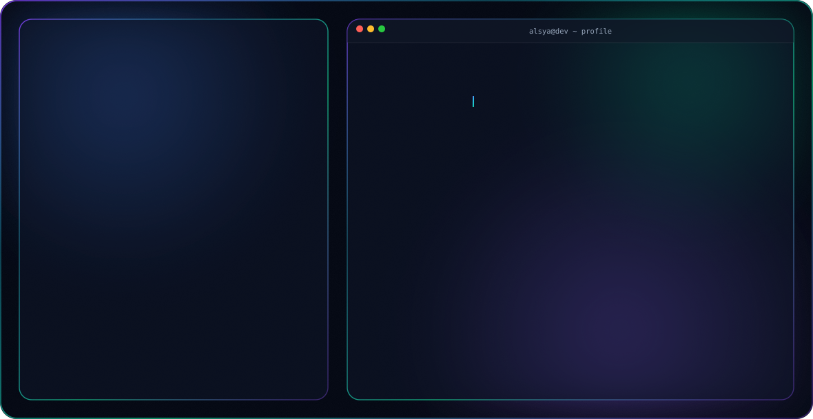

<div align="center">

<picture>
    <source media="(prefers-color-scheme: dark)" srcset="./assets/dark.svg">
    <source media="(prefers-color-scheme: light)" srcset="./assets/light.svg">
    
</picture>

<br>

# Hi, I'm Alsya Kanaya Dzikra 👋

### Full Stack Engineer • AI Builder • Problem Solver

> *"Gass ajahh, gimana mau sakses kalau terlalu banyak 'ahh tapii'"*
> — Sivia, The Catch Up Club

</div>

---

## 📖 About Me

```yaml
name: Alsya Kanaya Dzikra
nickname: Naya
location: Magelang, Central Java, Indonesia

education:
  - SMK jurusan RPL (Rekayasa Perangkat Lunak)
  - Information Technology Student @ Universitas Tidar (UNTIDAR)

focus:
  - Full Stack Web Engineering
  - AI/LLM Integration & AI Agents
  - System Architecture & Design

motto: "Gass ajahh, gimana mau sakses kalau terlalu banyak 'ahh tapii'"
```

---

## 🐍 Contribution Snake

<picture>
  <source media="(prefers-color-scheme: dark)" srcset="https://raw.githubusercontent.com/alsyakd/alsyakd/main/github-snake-dark.svg">
  <source media="(prefers-color-scheme: light)" srcset="https://raw.githubusercontent.com/alsyakd/alsyakd/main/github-snake.svg">
  
</picture>

---

## 💡 What I Build

<table>
<tr>
<td width="50%">

### 🎫 Event Ticketing System
A feature-rich fullstack event booking platform.

**Highlights:**
- Live payment receipt verification
- Auto-restoring voucher inventories
- Responsive operations check-in dashboard
- QR code scanning for entry

`Node.js` `Express` `QR` `Payment Integration`

</td>
<td width="50%">

### 🌳 SodakohPohon
Startup donasi pohon untuk carbon offset & restorasi ekosistem di Indonesia.

**Highlights:**
- Interactive mapping with Leaflet.js
- Individual & corporate tree planting
- Carbon offset tracking system

`Laravel` `Leaflet.js` `MySQL`

</td>
</tr>
<tr>
<td width="50%">

### 🏫 SekolahPintar.my
SaaS platform manajemen sekolah all-in-one.

**Highlights:**
- Multi-tenant school profile system
- Teacher/student/employee attendance
- Redesigned school frontend & dashboard

`Full Stack` `SaaS` `Dashboard`

</td>
<td width="50%">

### 🤖 Gemini AI Chatbot
Lightweight AI chatbot powered by Google Gemini 2.0+.

**Highlights:**
- Clean Node.js + Express architecture
- Google Gemini SDK integration
- Minimal dependencies, maximum performance

`Node.js` `Express` `Gemini SDK`

</td>
</tr>
<tr>
<td colspan="2">

### 📚 And more...
Sim Akademik • Company Profiles • Landing Pages • E-Commerce platforms — always building, always shipping.

</td>
</tr>
</table>

---

## 🛠️ Tech Stack

**Languages**

<p align="left">

</p>

**Frontend**

<p align="left">

</p>

**Backend**

<p align="left">

</p>

**Database**

<p align="left">

</p>

**AI & Tools**

<p align="left">

</p>

---

## 📚 Currently Learning

```text
Software Engineering & AI
┣━━ System Design & Architecture
┣━━ AI/LLM Integration & AI Agents
┣━━ Cloud Technologies (GCP/AWS)
┣━━ Backend Engineering & APIs
┗━━ Open Source Contribution
```

**Active Courses:** Dicoding, and other platforms — continuously upskilling.

---

## 📊 GitHub Analytics

<div align="center">


</div>

<div align="center">


</div>

<div align="center">


</div>

---

## 🎯 Goals for 2026

- [ ] Ship **3+ projects** to production with real users
- [ ] Earn **cloud/AI certification** (GCP or AWS)
- [ ] Contribute to **5+ open source projects**
- [ ] Build an **AI-powered product** solving real-world problems
- [ ] Compete in **national/international hackathons**
- [ ] Master **System Design & Software Architecture**

---

## 📬 Let's Connect

<div align="center">

<a href="https://github.com/alsyakd">

</a>

<a href="https://www.linkedin.com/in/alsya-kanaya-dzikra-akd07">

</a>

<a href="mailto:alsyakanayadzikra@gmail.com">

</a>

</div>

---

<div align="center">

### Thanks for visiting my profile! 🚀


<br>

#### Building systems that solve real problems.

</div>
